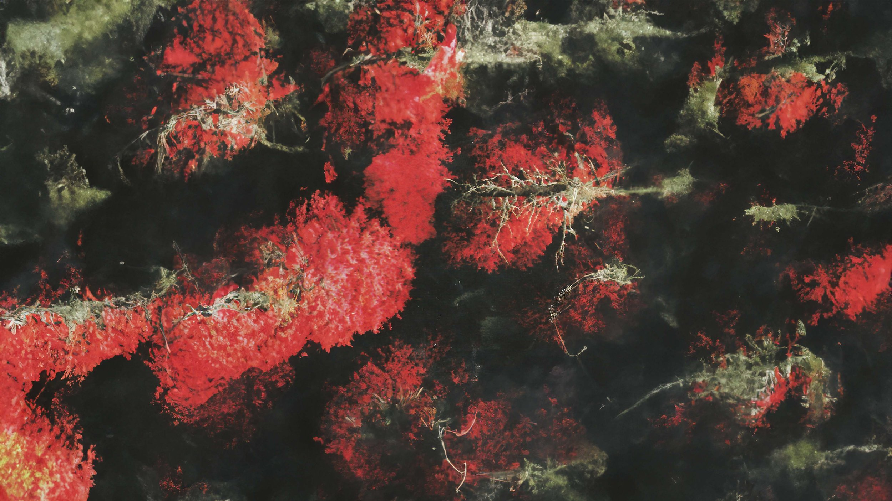
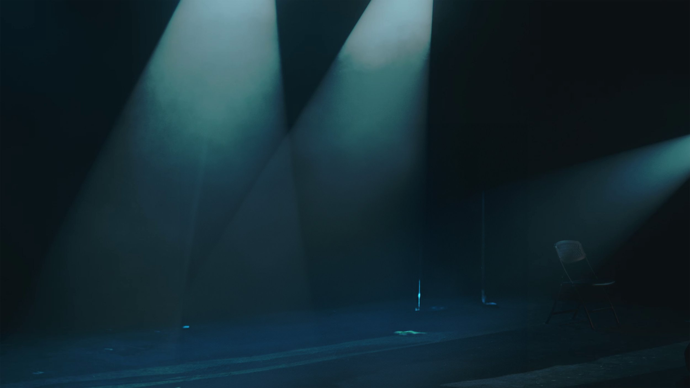

# Site Documentation

The hand-coded static rebuild of **alkabil.audio**. No frameworks, no build
step: plain HTML pages, one stylesheet, one small script. Everything you'd
normally do in Squarespace's editor is a text edit here.

Contents:

1. **[Quick recipes](#1-quick-recipes)** — the edits you'll actually make
   - [1.1 Add a new artist page (the full walkthrough)](#11-add-a-new-artist-page-the-full-walkthrough)
     - [1.1.1 How the pieces connect](#111-how-the-pieces-connect)
     - [1.1.2 The two steps to add an artist](#112-the-two-steps-to-add-an-artist)
     - [1.1.3 Setting, changing, and adding releases](#113-setting-changing-and-adding-releases)
     - [1.1.4 Artist images — where they go and how big](#114-artist-images--where-they-go-and-how-big)
   - [1.2 Change the newest release (home page)](#12-change-the-newest-release-home-page)
   - [1.3 Edit the FAQ (Info page)](#13-edit-the-faq-info-page)
   - [1.4 Change colors](#14-change-colors)
   - [1.4a The header bar: scroll fade, height, width](#14a-the-header-bar-scroll-fade-height-width)
   - [1.5 The marquees](#15-the-marquees)
   - [1.6 Fonts](#16-fonts)
   - [1.7 The newsletter form](#17-the-newsletter-form)
   - [1.8 Add a whole new top-level page](#18-add-a-whole-new-top-level-page)
   - [1.9 The header, footer, and nav are one-edit](#19-the-header-footer-and-nav-are-one-edit-jssitejs)
   - [1.10 Bring back the Merch page](#110-bring-back-the-merch-page)
   - [1.11 Change the height of things](#111-change-the-height-of-things)
   - [1.12 Artist page: bio width and name size](#112-artist-page-bio-width-and-name-size)
   - [1.13 Release-cover "window" shape (the tilted square)](#113-release-cover-window-shape-the-tilted-square)
   - [1.13a Release-cover shadow and hover grow](#113a-release-cover-shadow-and-hover-grow)
   - [1.13b Rounded section corners](#113b-rounded-section-corners)
   - [1.13c Artist-page release layout — alignment, hover area, the button](#113c-artist-page-release-layout--alignment-hover-area-the-button)
   - [1.14 Writing HTML here — a mini style guide](#114-writing-html-here--a-mini-style-guide)
   - [1.15 The hero concentric-ring parallax](#115-the-hero-concentric-ring-parallax)
   - [1.16 The film-grain / static overlay](#116-the-film-grain--static-overlay)
   - [1.17 Info page: the text/photos split and the FAQ animation](#117-info-page-the-textphotos-split-and-the-faq-animation)
2. **[How the site is organized](#2-how-the-site-is-organized)**
3. **[Deploy and local preview](#3-deploy-and-local-preview)**
4. **[Links and URLs](#4-links-and-urls)**
5. **[Troubleshooting](#5-troubleshooting)**
6. **[Changelog](#6-changelog)**

---

## 1. Quick recipes

### 1.1 Add a new artist page (the full walkthrough)

Artist pages are the **only** subpages on the site. Each artist is one HTML file
in the `artists/` folder (this mirrors the jehernandez site's `work/`):

```
artists.html              ← the portfolio grid — the list of all artists
artists/
  yslas.html              ← one artist page
  jehernandez.html        ← one artist page
```

#### 1.1.1 How the pieces connect

There is **one source of truth** for who the artists are — the `ARTISTS` array
near the top of `js/site.js`:

```js
const ARTISTS = [
  { id: 'yslas',       name: 'Yslas',          img: 'assets/yslas.jpg' },
  { id: 'jehernandez', name: 'J.E. Hernández', img: 'assets/hernandez.jpg' },
];
```

Each entry has three fields:

- **`id`** — the URL/filename slug. The page must be `artists/<id>.html` and the
  page's `<body data-artist="<id>">` must match. Lowercase, no spaces.
- **`name`** — what visitors see (in the grid tile and in the Prev/Next links).
  Accented characters are fine here (it's JS, not HTML) — `J.E. Hernández`.
- **`img`** — the photo shown in the portfolio grid, written root-relative
  (`assets/…`). `js/site.js` rewrites the path for page depth automatically, so
  you always write it as if from the site root.

This one array drives **both**:

1. the **portfolio grid** on `artists.html` (each entry becomes a tile), and
2. the **Previous / Next** navigation at the bottom of every artist page.

The **order of the array is the running order.** Paging is linear and does
**not** wrap: the first artist shows only a "Next" link, the last shows only a
"Previous", and anyone in the middle shows both. (With today's two artists,
Yslas is first → shows only Next; Hernández is last → shows only Previous.)
Reorder the array to reorder the grid and the paging; you don't touch any page
to do it.

#### 1.1.2 The two steps to add an artist

**Step 1 — register them.** Add one line to `ARTISTS` in `js/site.js`. Put it in
the position you want them to appear in the grid and the paging order:

```js
const ARTISTS = [
  { id: 'yslas',       name: 'Yslas',          img: 'assets/yslas.jpg' },
  { id: 'newartist',   name: 'New Artist',     img: 'assets/newartist.jpg' },
  { id: 'jehernandez', name: 'J.E. Hernández', img: 'assets/hernandez.jpg' },
];
```

Drop the grid photo into `assets/` first (see §1.1.4 for size/format).

**Step 2 — create the page.** Copy an existing artist file (e.g.
`artists/yslas.html`) to `artists/newartist.html` and edit it. The parts to
change, top to bottom:

- **`<title>`** in the `<head>`: `New Artist &mdash; ALKABIL`.
- **`<body … data-artist="newartist">`** — this must equal the `id`. This is how
  the page knows which artist it is (for Prev/Next). If it's wrong or missing,
  the Prev/Next bar simply won't render.
- **Bio section** (`<section>` with the `artist-bio` block):
  - `<h1>` — the artist's name. Use HTML entities for accents in HTML
    (`Hern&aacute;ndez`).
  - one or more `<p>` — the bio copy.
  - `<p class="artist-links">` — the external links (website, instagram, …),
    each a normal `<a href>`; remove or add `<a>`s freely.
- **Banner section** (`artist-banner`): swap the `` to the artist's
  wide banner photo. **Paths inside `artists/` start with `../`**, e.g.
  `../assets/newartist-banner.jpg`.
- **Release section** — covered in detail next (§1.1.3).
- **Leave** `<nav class="item-pagination" data-artist-nav></nav>` exactly as is
  — `js/site.js` fills in the Prev/Next links from the registry.
- The header (`<header class="site-header">`) and footer
  (`<footer class="site-footer">`) are empty shells filled by the script —
  don't put anything in them.

That's it. You never edit the other artists' pages, and the grid on
`artists.html` picks the new artist up automatically.

#### 1.1.3 Setting, changing, and adding releases

The release block sits at the bottom of the artist page, before the Prev/Next
nav. It has four editable parts:

```html
<section class="page-section theme-white section-height--medium">
  <div class="fgrid">
    <!-- the cover art — row-start (5) matches the title's, §1.13c -->
    <div class="blk release-cover clip-diamond" style="--gd: 5/15/24/26;">
      
    </div>
    <!-- the title -->
    <div class="blk" style="--gd: 5/2/10/13;">
      <h2 class="release-title">release title here</h2>
    </div>
    <!-- the blurb -->
    <div class="blk release-desc" style="--gd: 10/2/16/13;">
      <p>A sentence or two about the release…</p>
    </div>
    <!-- the button — 6 columns wide so the label can't wrap, §1.13c -->
    <div class="blk" style="--gd: 16/2/18/8;">
      <a class="btn" href="https://tr.ee/…" target="_blank" rel="noopener">LISTEN/BUY</a>
    </div>
  </div>
</section>
```

To **change the release**, edit in place:

1. **Cover art** — replace the `` (drop the file in `assets/`; the path
   is root-absolute, `/assets/…`). Covers are square; the `clip-diamond` class
   shows it through a tilted-square window (§1.13 — currently switched off).
   **If you move the title's row-start, move the cover's to match** — that's what
   keeps the artwork level with the title (§1.13c).
2. **Title** — the `<h2 class="release-title">`. It's forced to lowercase by CSS
   (`text-transform`); type it however you like.
3. **Blurb** — the `<p>` inside `release-desc`. Add more `<p>`s for more
   paragraphs; wrap a phrase in `<em>…</em>` for italics; links are normal
   `<a href>`.
4. **Button** — the `.btn` link. Point `href` at the release's Linktree /
   Bandcamp / store URL. If nothing is out yet, use `href="#"` and change the
   text to e.g. `coming soon` (see Yslas' page for the "no release yet" version).

The `--gd` values position each block on the desktop grid (row/col numbers, see
§2 and §1.11); leave them unless you want to move things. On mobile the blocks
just stack in source order.

**Adding another release (an artist with several).** An artist can list any
number of releases — each release is one whole `<section>` (the block shown
above), and they simply stack down the page. To add one:

1. **Copy the entire release `<section>…</section>`** and paste it directly
   above or below the existing release section.
2. **Order = document order.** The release whose `<section>` comes **first** in
   the HTML shows **higher** on the page; a later `<section>` shows below it. So
   to feature a new release above the current one, paste it *before* that
   section; to list it underneath, paste it *after*. On mobile they stack
   top-to-bottom in exactly this order.
3. **Keep the Prev/Next nav last.** `<nav class="item-pagination" …>` must stay
   the final thing in `<main>`, after **all** release sections.
4. **Fill in the four parts** of the new section exactly as above — cover,
   title, blurb, button — so every release has the identical format. Each
   section carries its own `clip-diamond` (or not) and its own `--gd`
   placements; leave the `--gd` values the same on each release and they'll all
   lay out identically.

There's no limit — three or four release sections stack the same way. (In-page
reminder: there's a comment on the release section in each artist's HTML.)

#### 1.1.4 Artist images — where they go and how big

Two images per artist, both in `assets/`:

- **Grid photo** (the `img` in the registry) — shown in the portfolio tile,
  cropped to fill (`object-fit: cover`), roughly portrait. ~800–1200 px on the
  short side is plenty.
- **Banner photo** (the `` in `artist-banner`) — a wide, full-bleed strip
  ~88vh tall; use a landscape/large image, ~1500 px wide.

You can use the **same file** for both if it crops acceptably in each spot.
Keep files web-sized (long edge ~1500 px, JP\[E]G quality ~80, aim < ~350 KB) —
compress big originals before adding them. (For reference, the Hernández photo
was made from a high-res original scaled to 1500 px wide at quality 80 ≈
295 KB.)

**Crop anchoring (`object-fit: cover`).** Both the grid tile and the banner crop
the photo to fill their box, centred by default. For a tall portrait/headshot
that means the *middle* of the photo (chest) can end up framed and the face cut
off. Anchor the crop upward instead:

- **Grid tile**: add an optional **`focus`** to the artist's registry entry — a
  CSS `object-position` value. `'center 12%'` pulls the crop near the top so the
  face shows (see Hernández's entry). Omit it to keep the default centre.
- **Banner**: set it inline on that page's banner ``, e.g.
  `style="object-position: center 12%;"` (Hernández's page does this).

Smaller percentage = higher anchor (nearer the top of the photo).

### 1.2 Change the newest release (home page)

In `index.html`, the last section before the footer:

- **Cover**: replace `assets/cover-2kx2k.jpg` (or add a new file and update
  the `` in the `release-cover` block). Square, ~1500–2500 px.
- **Link**: the `<a href>` around the cover — currently the release's
  Linktree (`tr.ee/...`).
- The "NEWEST ///" and "release \\\" marquees don't need touching; to change
  their words see §1.5.

### 1.3 Edit the FAQ (Info page)

`info.html`, the SOME ANSWERS section. Each Q&A is a native
`<details>` block:

```html
<details>
  <summary>THE QUESTION?</summary>
  <div class="faq-answer"><p>The answer.</p></div>
</details>
```

Add or remove whole `<details>` blocks; the +/× icon and the divider lines come
from CSS (`.faq` in `css/style.css`). Keep the inner `<div class="faq-answer">`
wrapper — the open/close animation (§1.17) needs it. New blocks are picked up
automatically; nothing needs registering.

**Answers longer than one paragraph** need their `<p>`s wrapped in a single
element, because the slide animates one grid row — a second child would sit in
an implicit row that never collapses, and part of the answer would stay on
screen. So:

```html
<div class="faq-answer">          <!-- ✅ one child, many paragraphs -->
  <div>
    <p>First paragraph.</p>
    <p>Second paragraph.</p>
  </div>
</div>

<div class="faq-answer">          <!-- ❌ two children — breaks the animation -->
  <p>First paragraph.</p>
  <p>Second paragraph.</p>
</div>
```

Spacing between those paragraphs is handled by `.faq .faq-answer p + p`. The
"WHAT ABOUT AI?" entry is the worked example. (A single-paragraph answer needs
no wrapper — the `<p>` *is* the one child.)

### 1.4 Change colors

Top of `css/style.css`:

```css
--white / --black        the two poles
--accent                 the light-gray "bright" section background (85%)
--light-accent, --dark-accent
--hero-red               dark red pulled from the hero photo, as R,G,B numbers
                         (not a hex) so it can be used as rgba(var(--hero-red), a)
```

Sections pick their palette with a theme class on the `<section>`:
`theme-black` (white on black), `theme-white` (black on white),
`theme-bright` (black on light gray) — same trio as the Squarespace themes
the original used.

**The red frosted bars.** The fixed **header** (`.site-header`) and the
full-screen mobile **menu** (`.mobile-menu`) both tint with `--hero-red`, but at
different strengths — change `--hero-red` to re-tint both at once, or each rule's
alpha to change one:

| | Tint | Blur |
|---|---|---|
| Header, scrolled (`.site-header.scrolled`) | `rgba(var(--hero-red), 0.22)` | 6px |
| Mobile menu (`.mobile-menu`) | `rgba(var(--hero-red), 0.72)` | 14px |

The menu's alpha is deliberately high: it covers the **dark** hero, and a red at
low opacity composites down to near-black there (so it *looks* black) — keep it
around `0.7` for the red to read. How the header bar *behaves* — when it tints
in, its height and width — is §1.4a.

### 1.4a The header bar: scroll fade, height, width

- **Fades in on scroll.** At the top of the page the bar is fully transparent;
  `js/site.js` adds `.scrolled` once past `HEADER_SHOW_AFTER` (**40px** — change
  that constant to make it appear sooner/later) and removes it again at the very
  top. The fade itself is the CSS `transition` on `.site-header` (0.4s); the JS
  only toggles the class.
- **It works on every page**, not just the home page. The only thing that varies
  is the nav's colour while the bar is still clear, which depends on what the
  page opens on. `wireHeaderScroll` checks the **first `.page-section`'s theme**:
  - opens on `theme-white` / `theme-bright` (info, artist pages) → the header
    gets **`.on-light`** and the nav switches to **dark** text until the tint
    fades in, since white-on-white would be invisible;
  - opens on the dark hero, or on photos with no `.page-section` at all (the
    artists grid) → **white** text, plus a soft `drop-shadow` on `.header-inner`
    so it stays legible over bright patches of the image behind;
  - once `.scrolled`, every page is back to white text on the red tint.

  This is automatic — a new page picks the right mode from its first section, so
  there's nothing to register. If a page guesses wrong, force it by adding or
  removing `on-light` on the header in `wireHeaderScroll`. While the mobile menu
  is open the nav is always white (it sits on the red overlay).
- **Height.** `padding: 0.9rem var(--gutter)` on `.site-header`. If you change
  it, update **`--header-h`** (currently `76px`) to match — pages that start
  under the fixed bar use it as their top padding.
- **Width.** The bar's contents are full-bleed: `.header-inner` has no
  `max-width`, so it's inset only by `--gutter` (the same padding as the
  "WE ARE …" section) and adapts to any screen automatically. The footer
  (`.footer-inner`) works identically.
- **Link order.** Info / Artists / Releases sit in the left nav
  (`NAV_LINKS` + `RELEASES` in `js/site.js`); the right side holds the Instagram
  icon and the burger. Below **880px** the left nav and icon hide and the burger
  takes over.
- **Mobile menu animation.** Opening fades the overlay (`menu-fade`) and staggers
  the links in (`menu-item-in`, 0.25s each, 0.05s apart). The stagger is a list
  of `:nth-child` delays — add more lines if the menu grows past six links. Both
  are disabled under `prefers-reduced-motion`.

### 1.5 The marquees

A marquee is:

```html
<div class="marquee" style="--speed: 26s;">
  <div class="track" aria-hidden="true">
    <span>WORD ///</span><span>WORD ///</span>...
  </div>
</div>
```

The `track` scrolls left by half its width and loops, so **the spans must
repeat enough times to fill the screen twice** (six copies is plenty).
`--speed` is the loop duration — smaller is faster. Add class `reverse` to
scroll right instead. Respects `prefers-reduced-motion`.

(The 404 page has its own inlined copy of this CSS — if you retune the
marquee look, mirror it there.)

### 1.6 Fonts

Everything is set in **Academico**, self-hosted as four woff2 files in
`assets/fonts/` (regular / bold / italics — the same files as the
jehernandez site). It's a stand-in until a proper replacement for the
original site's minerva-modern (headings) and anziano (body) is chosen.

To swap in a different font later:

1. Drop its woff2 files in `assets/fonts/`.
2. Copy the four `@font-face` blocks at the top of `css/style.css`, point
   them at the new files with a new family name.
3. Put that name in `--heading-font` and/or `--body-font` (the two fonts can
   differ, as they did on Squarespace). Headings are automatically
   uppercased (`text-transform` on the `h1–h4` rule) — remove that line if
   the new heading font shouldn't be.

Font URLs inside the CSS are relative to the CSS file, so they work at any
deploy depth; nothing else needs touching.

### 1.7 The newsletter form

`info.html`. As shipped, submitting shows "Thank you!" (handled in
`js/main.js`) and — on Netlify — is stored by Netlify Forms (the form carries
`data-netlify="true"`). **GitHub Pages has no form backend**, so on GitHub
Pages the thank-you appears but nothing is stored. To make it real there, use
a mail-in form service (e.g. Web3Forms, like the jehernandez site's contact
form): add your access key as a hidden input, point the `fetch()` in
`js/main.js` at `https://api.web3forms.com/submit`, and allow that origin in
`_headers`' `connect-src`/`form-action` if you also deploy to Netlify.

### 1.8 Add a whole new top-level page

1. Create `newpage.html` **in the root folder** (copy `info.html` for the
   scaffold — the empty `<header>`/`<footer>` shells and the `<script>` tag —
   and gut the `<main>`). Only artist pages live in a subfolder; everything
   else is a root-level `.html` file. It will be served at **`/newpage`**.
2. Build sections as `<section class="page-section theme-...">` containing a
   `.fgrid` with `.blk` children (see §2 for the grid).
3. Link it from the nav by adding a line to `NAV_LINKS` in `js/site.js` — use
   the clean slug, `['New page', '/newpage']` (no `.html`, leading `/`; §4.1).
   That updates the header and mobile menu on **every** page at once (§1.9).

### 1.9 The header, footer, and nav are one-edit (js/site.js)

The header, mobile menu, and footer are **injected by `js/site.js`** into empty
shells (`<header class="site-header">`, `<footer class="site-footer">`), so
their contents live in one place instead of being copied into every page:

- **Nav links** (header + mobile menu): the `NAV_LINKS` array.
- **Footer** columns: `FOOTER_LEFT` / `FOOTER_RIGHT`; the `© <year>` fills
  itself from the current date, so it never needs editing.
- The script also detects page depth (root vs. `artists/`) and prefixes every
  internal link/asset automatically — no per-page or `../` bookkeeping.

Edit those arrays once and every page updates. (If a page ever shows a bare
missing header/footer, its `<script src=".../site.js">` tag didn't load.)

### 1.10 Bring back the Merch page

The Merch page was deliberately left out of this rebuild. Its URL is covered
by two placeholders — replace/delete when you build the real thing:

- `merch.html` (meta-refresh → Bandcamp)
- the `/merch` line in `_redirects` (Netlify only)

Then build `merch.html` like any page (§1.8) and add "Merch" back to the
header nav and mobile menu in every page.

### 1.11 Change the height of things

Heights come from three mechanisms, depending on what you're resizing:

**a) Whole sections** use a size class on the `<section>`:

| Class                     | What it does                                   |
| ------------------------- | ---------------------------------------------- |
| `section-height--large`   | `min-height: 100vh` (full screen — the hero)   |
| `section-height--medium`  | `4rem` top/bottom padding around its content   |
| `section-height--small`   | `2rem` top/bottom padding                       |
| *(no class)*              | height is just whatever the content needs      |

Swap the class on a section to change its band of vertical space, or edit the
numbers in `css/style.css` (search `section-height--`). To make the hero *not*
full-screen, change `.section-height--large { min-height: 100vh; }` (e.g. to
`80vh`).

**b) A single block inside a section** (desktop) gets its height from how many
grid **rows** its `--gd` spans. `--gd` is `row-start / col-start / row-end /
col-end`; a bigger gap between row-start and row-end = taller. One row is
`--row-h`, currently ~2.15% of the content width (`--row-h` in the
`@media (min-width: 768px)` block of `css/style.css`) — raise that factor to
make every row (and thus the whole desktop grid) taller. On mobile the `--gd`
rows are ignored and blocks size to their content.

**c) Specific fixed-height elements** have their own rule in `css/style.css`:

- **Artist banner strip**: `.artist-banner { height: 88vh; }`
- **Portfolio grid** (artists page): `.portfolio-grid { min-height: 100vh; }`,
  and on mobile each tile is `.portfolio-grid .grid-item { min-height: 50vh; }`
- **Hero**: the `section-height--large` above.

Change the value in the rule to resize.

### 1.12 Artist page: bio width and name size

**Width of the name + bio.** On desktop, the bio block's width is set by its
grid area — the `--gd` on the `artist-bio` div in each artist page:

```html
<div class="blk artist-bio" style="--gd: 2/4/14/22;">
```

The two **column** numbers (here `4` … `22`) are the left and right edges on the
24-column grid. Columns run **1–27**, where 1 and 27 are the outer gutters, so
usable content lives in **2–26**. So:

- **Wider** → smaller col-start / larger col-end (e.g. `2/3/14/25`, or full
  content width `2/2/14/26`).
- **Narrower** → move them inward (the old value was `…/8/…/20`).

Change it on each artist page independently. (On mobile the grid areas are
ignored and the bio is full-width with gutters regardless.)

**Name size.** The artist name is deliberately about half the normal `h1`. It's
set once in `css/style.css`:

```css
.artist-bio h1 { font-size: clamp(1.8rem, 6vw, 2.5rem); }
```

`clamp(min, fluid, max)` means it scales with the viewport (`6vw`) but never
below `1.8rem` or above `2.5rem`. Raise or lower the `2.5rem` **max** to resize
the name on desktop; raise/lower the `1.8rem` **min** for the smallest screens.

### 1.13 Release-cover "window" shape (the tilted square)

Each release cover can be shown through a tilted-square **window** — a
45°-rotated square (a diamond) — instead of a plain square. It's a CSS
`clip-path`, so it's lean and needs no image editing.

**Currently OFF.** The master switch is one line at the top of `css/style.css`,
in `:root` — swap the value to toggle it site-wide, no page edits:

```css
--cover-clip: none;                                          /* OFF (current) */
--cover-clip: polygon(50% 0%, 100% 50%, 50% 100%, 0% 50%);   /* ON — the window */
```

The per-cover `clip-diamond` classes are still on the artist covers; with
`--cover-clip: none` they simply do nothing, so flipping the value above brings
the effect straight back.

> **Note:** the window and the covers' drop shadow (§1.13a) don't combine — a
> `clip-path` cuts away everything outside the shape, shadow included. Turn the
> window on and the shadow disappears; that's expected, not a bug.

**Turn it on/off per cover:** add or remove the `clip-diamond` class on the
cover's `.release-cover` div:

```html
<div class="blk release-cover clip-diamond" style="--gd: 5/8/21/20;">
  <a href="…"></a>
</div>
```

Remove `clip-diamond` → that one cover shows as a full square. The class sits on
**artist release covers only**; the home page's newest-release cover is left a
plain square on purpose. (With the master switch off, none of them are windowed
right now.)

**Change the album image:** just swap the `` inside `.release-cover`
(square art works best; the window crops the four corners).

**Change the window shape:** edit the `--cover-clip` value in `:root` (it feeds
the `clip-path`, so any `clip-path` value works):

```css
--cover-clip: polygon(50% 0%, 100% 50%, 50% 100%, 0% 50%);   /* diamond */
```

The polygon is a list of `x% y%` corner points. Examples to drop in:

- Diamond (current): `polygon(50% 0%, 100% 50%, 50% 100%, 0% 50%)`
- Hexagon: `polygon(25% 0%, 75% 0%, 100% 50%, 75% 100%, 25% 100%, 0% 50%)`
- Chamfered/cut corners: `polygon(12% 0, 88% 0, 100% 12%, 100% 88%, 88% 100%, 12% 100%, 0 88%, 0 12%)`
- Circle: `circle(50%)` — no polygon needed.
- Off: `none`

To make a **new** named window (so different covers can use different shapes),
add a rule with its own class (e.g.
`.release-cover.clip-hex img { clip-path: polygon(…); }`) and put that class on
the cover instead of `clip-diamond`.

### 1.13a Release-cover shadow and hover grow

Every release cover — on the artist pages **and** the home newest-release block —
sits under a soft drop shadow and grows slightly when the pointer is over it.
All of it is the `.release-cover` rules in `css/style.css`:

- **Grow amount**: `--cover-hover-scale` in `:root` (currently `1.04` = 4%
  bigger). Set it to `1` to switch the grow off while keeping the shadow.
- **Speed/feel**: the `0.45s` transition on `.release-cover img` — it covers both
  the scale and the shadow, so they move together.
- **Shadow**: two `box-shadow`s — the resting one on `.release-cover img`, the
  deeper hover one on `.release-cover:hover img`. Raise the blur/offset for a
  more lifted look, or delete both lines for a flat cover.
- The hover is on the **wrapper**, not the `<a>`, so it also works on covers that
  aren't links yet (a "coming soon" release with no LISTEN/BUY target).
- The grow is disabled under `prefers-reduced-motion`; the shadow stays.
- Remember the interaction with the window crop: while `--cover-clip` is on, the
  shadow is clipped away (§1.13).

### 1.13b Rounded section corners

The home newest-release section has curved corners while still running the full
width of the page. It's one class in the markup:

```html
<section class="page-section theme-black section-height--medium rounded-section">
```

- **Radius**: `--section-radius` in `:root` (currently `28px`). Phones get 60% of
  it automatically so the curve stays in proportion.
- It works because `.page-section` already clips its contents
  (`overflow: hidden`), so the background photo and the grain overlay follow the
  rounding — nothing extra needed.
- The corners reveal the page background (`body` is black) behind them.
- **To round another section**, just add `rounded-section` to it. To square this
  one off again, remove the class.

### 1.13c Artist-page release layout — alignment, hover area, the button

The release block on an artist page is a two-column layout built on the 24-column
`.fgrid`: **text on the left**, **cover on the right**. Nothing about that layout
is automatic — each block is placed by hand with its own `--gd`
(`row-start / col-start / row-end / col-end`), so the three rules below are what
keep it looking right. Get one wrong and the symptoms are exactly the ones that
have bitten this page before.

#### The anatomy

```html
<section class="page-section theme-white section-height--medium">
  <div class="fgrid">
    <div class="blk release-cover" style="--gd: 5/15/24/26;">   <!-- cover, right -->
      
    </div>
    <div class="blk" style="--gd: 5/2/10/13;">                  <!-- title, left -->
      <h2 class="release-title">the title</h2>
    </div>
    <div class="blk release-desc" style="--gd: 10/2/16/13;">    <!-- blurb -->
      <p>…</p>
    </div>
    <div class="blk" style="--gd: 16/2/18/8;">                  <!-- button -->
      <a class="btn" href="…">LISTEN/BUY</a>
    </div>
  </div>
</section>
```

Columns: the text column runs **2 → 13**, the cover **15 → 26** (column 14 is the
gap between them). Those rarely need changing.

#### Rule 1 — the cover's row-start must equal the title's row-start

**This is the one that matters.** Above, both are `5`. Because the two blocks are
placed independently, any difference is a permanent vertical offset:

```
--gd: 3/15/24/26   ← cover starts row 3
--gd: 5/2/10/13    ← title starts row 5     → cover floats ~2 rows above the text
```

Grid rows are a **fixed height** (`--row-h`, derived from the viewport width),
*not* a share of the content — so the offset doesn't shrink when text is short;
it's the same gap on every page. It simply *reads* worse next to a tall text
column, which is why a long description makes it obvious while a one-line blurb
hides it.

So: **when you change a title's row-start, change the cover's to match.** If you
restack the left column (e.g. a longer blurb pushes the button down), only the
row-*ends* below it need adjusting — the shared row-start stays put.

Note the cover aligns to the top of the title's *box*. `.release-title` uses a
tight `line-height: 1.12em` so that box hugs the letterforms; if you loosen the
leading, the artwork will start to look high again.

#### Rule 2 — the cover block hugs its image (`align-self: start`)

A `.blk` normally **stretches** to fill its whole grid area. The cover's area is
tall (rows 5→24) but the image is only as tall as its aspect ratio, so the block
would keep a tall invisible tail underneath — and since the hover lives on the
block, **hovering that empty space below the artwork triggered the grow**.

`.release-cover { align-self: start; }` in `css/style.css` fixes it: the block
shrinks to the image, so the hover target is exactly the artwork you can see.
Don't override `align-self` on a cover, and keep the hover on `.release-cover`
rather than the `<a>` — covers without a link (a "coming soon" release) still
need to respond.

The cover's **row-end** no longer controls its height (the image does), but it
still counts toward the section's total height — keep it roughly where the
artwork ends so the section doesn't collapse or leave a big gap.

#### Rule 3 — the button never wraps

`.btn` is `white-space: nowrap`, so a label like `LISTEN/BUY` always stays on one
line instead of breaking into `LISTEN/` + `BUY`. Because the button is
`inline-block` it sizes to its text, so give its block enough columns or it will
spill past its area:

- `--gd: 16/2/18/8` (6 columns) fits `LISTEN/BUY` comfortably.
- 4 columns is too narrow — that's what caused the wrap originally.
- A longer label (`PRE-ORDER NOW`) needs a wider end column still.

Spilling isn't fatal — the space to the right is empty — but widening the area is
tidier.

#### On mobile

Below 768px every `--gd` is ignored and blocks stack full-width **in document
order**. Since the cover is authored first, mobile shows: cover → title → blurb →
button. If you'd rather the artwork sat below the text on phones, move the
`.release-cover` div after the other three in the HTML — desktop is unaffected,
because there the grid areas place everything regardless of source order.

#### Checklist when adding or editing a release

1. Cover row-start **==** title row-start.
2. Left-column blocks stack without overlapping (each row-end ≤ the next
   row-start).
3. Cover row-end roughly where the artwork ends.
4. Button block wide enough for its label.
5. Swap ``, title, blurb, and the `.btn` href.

(Adding a *second* release = copying the whole `<section>`: §1.1.3.)

### 1.14 Writing HTML here — a mini style guide

The site is plain HTML/CSS; a few conventions keep it consistent:

- **Links are clean slugs starting with `/`** — `href="/info"`,
  `href="/artists/yslas"`, `href="/"` for home. No `.html`, no `../`; the same
  path works from every page (see §4.1). Asset paths follow the same rule:
  `src="/assets/…"`, `href="/css/style.css"`. Use `mailto:` for email and full
  `https://…` for off-site, always with `target="_blank" rel="noopener"` for
  external links.
- **Section skeleton** — a page's content is a stack of
  `<section class="page-section theme-…">`, each containing a `.fgrid`, each
  holding `.blk` children placed with `--gd` (§2). Reuse an existing section as
  a template rather than writing grid CSS by hand.
- **Themes** — `theme-black` (white on black), `theme-white` (black on white),
  `theme-bright` (black on light gray). Set the mood by the class on the
  section; don't set colors inline.
- **Headings** are auto-uppercased by CSS — type them normally; use
  `<h1>`…`<h4>` for scale (§1.4 / §2). Accented letters in HTML use entities
  (`&aacute;`, `&ntilde;`, `&mdash;`).
- **Images**: put files in `assets/`, keep them web-sized (§1.1.4), always give
  a meaningful `alt` (or empty `alt=""` for purely decorative ones).
- **Repeated chrome is injected, not copied** — header, mobile menu, and footer
  come from `js/site.js` (§1.9); artist grid and Prev/Next come from the
  `ARTISTS` registry (§1.1). Edit those in one place, never per page.
- **Full-bleed background photo**: a `<div class="section-bg"></div>` as
  the first child of a section (see the hero and newest-release sections).
- **Keep source order = reading order** — mobile ignores the desktop `--gd`
  grid and simply stacks blocks in the order they appear in the HTML.

### 1.15 The hero concentric-ring parallax

The top image on the home page is drawn as a set of **concentric rings** — an
inner disc plus rings radiating out, the outermost running past the screen edge.
Each ring holds its own copy of the image and slides with the pointer on **both
axes** (touch on mobile): the inner disc moves at a base speed and each ring
outward moves faster, so the image breaks into rings that shear against each
other, more toward the edge. At rest (pointer centred) every shift is zero and
the image is seamless. The ring count is computed automatically so the outermost
always clears the screen corner, whatever the window's size/shape.

**Markup** (`index.html`, in the hero section):

```html
<div class="section-bg"></div>
<div class="hero-parallax" data-img="assets/alkabil-web-1.jpg" aria-hidden="true"></div>
```

The `.section-bg` image is the **fallback** shown when JavaScript is off or the
visitor has *reduce motion* set; the `.hero-parallax` div is what `js/site.js`
fills with rings. Keep `data-img` pointing at the **same** file as the base
image (change both to change the hero photo).

**Tuning** — all knobs are the `HERO` object near the middle of `js/site.js`:

| Key            | Meaning                                                        |
| -------------- | ------------------------------------------------------------- |
| `innerDiv`     | inner-disc radius = `max(viewportW, viewportH) / innerDiv`. **Bigger number = smaller inner circle.** |
| `ringDiv`      | each ring's width = `max(viewportW, viewportH) / ringDiv`. **Bigger number = thinner rings** (and, since the count is auto, more of them). |
| `baseShift`    | px the inner disc slides at full pointer deflection — the base speed all rings build on. |
| `shiftPerRing` | extra px each ring adds outward — the radiating speed-up and how disjointed the shear looks. |
| `ease`         | pointer-follow smoothing, 0–1 (smaller = laggier, dreamier).  |
| `feather`      | px softness on each ring's edge. `0` = hard edges (as now); raise it to soften/anti-alias. |

(The number of rings is derived from `innerDiv`/`ringDiv` and the viewport — you
don't set it.)

Rings, their masks, and the image size recompute on resize. The effect is
disabled automatically under `prefers-reduced-motion`. The ring look (scrim,
overflow) is in `css/style.css` under "Hero concentric-ring parallax".

### 1.16 The film-grain / static overlay

Any section with a background image can carry an animated **grain/static**
overlay. It's a `<div class="grain">` placed after the section's `.section-bg`
and before its `.fgrid`:

```html
<div class="section-bg"></div>
<div class="grain" aria-hidden="true"></div>
<div class="fgrid"> … </div>
```

It's on the newest-release section today. To add it elsewhere, drop the same
`<div class="grain">` into another image section in the same spot. The noise is
a procedural inline SVG (`feTurbulence`, desaturated to grey) — **no image
asset**. All of it lives in the `.grain` rule and the `grain-flicker`
keyframes in `css/style.css`:

- **Strength**: `opacity` (currently `0.82`) — lower for subtler.
- **Grain size**: `background-size` (`130px`) — smaller = finer.
- **How busy the static is**: the `animation` duration/steps
  (`0.5s steps(4)`) — fewer/slower steps = calmer. Set `animation: none` for a
  still grain. It already stops under `prefers-reduced-motion`.
- **Blend**: `mix-blend-mode: overlay` — try `soft-light` (gentler) or
  `screen` (brighten-only).

### 1.17 Info page: the text/photos split and the FAQ animation

**The layout.** The whole info page above the newsletter is **one section**
(`.info-split`) with two columns — all the text on the left, both photos stacked
on the right:

```html
<section class="page-section theme-white info-split" style="padding-top: var(--header-h);">
  <div class="info-text">
    <h1 class="big-q">?</h1>
    <p class="info-intro">…</p>
    <h2 class="info-answers">SOME ANSWERS</h2>
    <div class="faq">…</div>
  </div>
  <div class="info-photos">
    
    
  </div>
</section>
```

It's deliberately *not* the `.fgrid` used elsewhere, because that grid's rows are
a **fixed** height — which is what used to make this page misbehave. The intro
and the FAQ were two separate sections, so the space between the photos was the
sum of one section's leftover rows plus the next one's padding: a gap that
changed with the window and never closed. Here the row height is driven by the
content instead.

**How the three rules fall out of that:**

1. **The photos always touch.** They're two children of one `.info-photos` grid
   with `gap: 0`. There is no section boundary between them any more, so there's
   nothing to introduce a gap.
2. **The photos always match the text's height.** The section is a grid with
   `align-items: stretch`, so the photo column stretches to the row height — and
   that height comes from the text column. `.info-photos` has
   `grid-template-rows: 1fr 1fr` (each photo takes half) and `min-height: 0`,
   which is the important bit: without it the images' natural heights would push
   the row taller instead of the text deciding it.
3. **The photos crop rather than distort.** Each `img` is
   `height: 100%; object-fit: cover`. Narrow the window and the column gets
   taller and thinner, so they simply crop in further — a "fit to area" window.
   It also re-matches live when a FAQ item opens and the text column grows.

**Column widths** use the same template as `.fgrid`, so the text lines up with
the rest of the site: `.info-text` sits at `grid-column: 2 / 13` (the same
columns "SOME ANSWERS" always used) and `.info-photos` at `14 / -1` — `-1` runs
through the right gutter so the photos bleed to the screen edge. Change those two
values to re-proportion the split.

**Text alignment.** Everything in `.info-text` shares one left edge; only the `?`
is centred (`.info-text .big-q { text-align: center }`). The vertical rhythm is
three margins in `css/style.css` — `.big-q` (top space under the header),
`.info-intro`, and `.info-answers` (the big breath before "SOME ANSWERS", 6.5rem).

**On mobile** (<768px) the grid rules drop away: the section becomes a plain
block, `.info-text` takes a `--gutter` inset, and the photos go full-width at
their natural aspect ratio — still stacked with no gap between them.

**To swap a photo**, change the ``. Any reasonably large landscape image
works, since it's cropped to fill; there's no aspect ratio to keep in sync any
more.

**The FAQ open/close animation.** A question slides its answer down when opened
and back up when closed — same 0.34s either way — while the `+` rolls into an
`×`. It's mostly the `.faq` rules in `css/style.css`, plus a small assist from
`wireFaq()` in `js/site.js`:

- **Opening is pure CSS.** A native `<details>` only renders its content once
  open, so a CSS *transition* never catches it — the reveal is a keyframe
  **animation** (`faq-reveal`) that plays the moment the answer appears.
- **The slide** is `grid-template-rows: 0fr → 1fr` on `.faq-answer`, animating a
  real height without a guessed `max-height` (so long answers can't get
  clipped). The inner element carries the padding and `overflow: hidden` so it
  clips itself while the row is still short. Because that's a **single** grid
  row, `.faq-answer` must hold exactly **one** child — multi-paragraph answers
  wrap their `<p>`s in one `<div>` (§1.3).
- **Closing needs the JS.** The browser drops a `<details>`'s content the instant
  `open` is removed, so left alone it snaps shut with nothing to animate.
  `wireFaq()` cancels that default click, adds `.closing` to play the reverse
  `faq-hide` animation, and only then sets `open = false` (with a 500 ms safety
  timeout so a panel can never stick open if the animation doesn't fire).
- **Speed**: change it in *three* matching places — `faq-reveal`, `faq-hide`, and
  the `summary::after` transition — so the two directions and the icon all stay
  in step. If you slow it past ~0.5s, raise `CLOSE_MS` in `wireFaq()` to match.
- **Rule order matters**: the `.faq details.closing …` rules must stay *after*
  the `.faq details[open] …` ones — identical specificity, so source order is
  what makes the closing state win.
- **The icon**: `content: "+"` with `transform: rotate(225deg)` when open (a
  half-turn into an ×). `rotate(45deg)` gives a plain × with no spin.
- Under `prefers-reduced-motion` the animations are off and the JS doesn't
  intervene, so it opens and closes instantly.

---

## 2. How the site is organized

```
index.html                  home
artists.html                artists portfolio grid
info.html                   info / FAQ / newsletter
merch.html                  placeholder → Bandcamp (see §1.10)
404.html                    not-found page, fully self-contained
artists/
  yslas.html                artist page
  jehernandez.html          artist page
css/style.css               the whole design system (incl. @font-face)
js/site.js                  injects header/menu/footer, artist grid +
                            prev/next (from the ARTISTS registry), the
                            copyright year, seamless marquees, newsletter
assets/                     all images
assets/favicon.svg          browser-tab icon — the red label mark (primary)
assets/favicon.png          256×256 PNG fallback of the same mark
assets/logo-red.png         red-mark source for regenerating favicon.png
assets/fonts/               Academico woff2 (self-hosted)
tools/make-favicon.py       regenerates assets/favicon.png from logo-red.png
_source/                    reference copies of the original Squarespace
                            pages this was rebuilt from (not linked
                            anywhere — safe to delete or .gitignore)
.nojekyll                   tells GitHub Pages not to run Jekyll
_headers, _redirects        Netlify-only (ignored by GitHub Pages)
```

**Favicon.** The tab icon is the red "Logo Red" label mark. Every page links it
twice, primary first:

```html
<link rel="icon" type="image/svg+xml" href="assets/favicon.svg">
<link rel="icon" type="image/png"     href="assets/favicon.png">
```

Modern browsers use the crisp vector `favicon.svg`; the `favicon.png` (256×256)
is the fallback for those that don't. Both are the red glyph on a transparent
background, so it reads on light and dark browser chrome alike. **To change it**,
replace `assets/favicon.svg` (any single-colour SVG works) and regenerate the
PNG from a raster source: drop the new mark at `assets/logo-red.png` and run
`python tools/make-favicon.py` (needs Pillow). Every page links it the same way,
root-absolute (`/assets/favicon.svg`), including `404.html`.

**The grid.** The original Squarespace "fluid engine" laid blocks on a
24-column grid; the rebuild keeps those exact placements. A section's content
is a `.fgrid` (24 columns + a gutter column each side, 11 px gaps, row height
~2.15% of the container). Each `.blk` child carries its desktop placement in
an inline custom property:

```html
<div class="blk" style="--gd: 10/8/26/20;">   <!-- rows 10–26, cols 8–20 -->
```

The four numbers are `row-start / col-start / row-end / col-end`, columns
1–27 (1 and 27 are the gutters, so content lives in 2–26). **On mobile
(<768 px) the grid areas are ignored** and blocks simply stack full-width in
document order — so keep the HTML in reading order.

**Header, mobile menu, and footer are injected by `js/site.js`** into empty
shells on each page (see §1.9), so the nav/footer live in one place. Pages
carry only `<header class="site-header"></header>` and
`<footer class="site-footer"></footer>`; the script fills them and prefixes
links for depth, so there's no per-page or `../` bookkeeping for those.

**The header is fixed and always on top** (`position: fixed; z-index: 1000`),
so it persists as content scrolls under it. It starts fully transparent on
**every** page and its faint red frosted tint **fades in once the page is
scrolled**. While the bar is clear, the nav colour adapts to whatever the page
opens on — dark text on white/bright-topped pages, white text (with a soft
shadow) over the hero and photos — so no page sets its own header color. Pages
whose content begins at the very top add `padding-top: var(--header-h)` to their
first section so nothing hides under the fixed bar. Full details — the scroll
threshold, the light/dark detection, height/`--header-h`, and the full-bleed
width — are in §1.4a.

**Section themes** (`theme-black` / `theme-white` / `theme-bright`) set
background + text color; a `section-bg` div with an `` inside makes a
full-bleed background photo (home hero and newest-release sections).

---

## 3. Deploy and local preview

**GitHub Pages** (the plan): push this folder to a GitHub repo →
Settings → Pages → deploy from branch. Already in place:

- `.nojekyll` — stops Jekyll from mangling files/skipping underscored paths;
- `404.html` — picked up automatically;
- **relative paths everywhere** — the site works both as a *project* page
  (`user.github.io/repo/`) and on a custom domain at the root;
- custom domain: enter `alkabil.audio` (or `www.`) in the Pages settings —
  **GitHub writes the `CNAME` file into the repo itself**, which is why this
  repo doesn't ship one — then point the domain's DNS at GitHub Pages and
  tick "Enforce HTTPS".

**Netlify** also works as-is: drag the folder onto app.netlify.com.
`_headers` (security headers/CSP) and `_redirects` (/merch, /cart) only take
effect there, and the newsletter form gets stored by Netlify Forms.

**Local preview.** Now that links are clean slugs served from the domain root,
you need a local server that (a) serves the folder at `/` and (b) resolves
`/info` to `info.html`. Double-clicking `index.html` no longer works — `file://`
can't resolve a path starting with `/`, so the CSS won't load.

Use a server with "pretty URL" support:

```
cd alkabil-clone
npx serve .                 # → http://localhost:3000   (clean URLs work)
```

or, if you have the Netlify CLI, `netlify dev` — closest to production, and it
also exercises `_headers` / `_redirects`.

⚠️ **`python -m http.server` won't work for navigation.** It serves files
verbatim and never appends `.html`, so the home page loads but every nav link
404s. It's fine for eyeballing one page, not for clicking around.

---

## 4. Links and URLs

**Clean slugs — no `.html` anywhere.** The URLs match the old Squarespace site
exactly:

| File on disk               | URL visitors see          |
| -------------------------- | ------------------------- |
| `index.html`               | `/`                       |
| `artists.html`             | `/artists`                |
| `artists/yslas.html`       | `/artists/yslas`          |
| `artists/jehernandez.html` | `/artists/jehernandez`    |
| `info.html`                | `/info`                   |
| `merch.html`               | `/merch` → Bandcamp (§1.10) |
| `404.html`                 | any unknown URL           |

This works with **no build step and no config**: GitHub Pages and Netlify both
serve `x.html` when asked for `/x`. You keep authoring plain `.html` files; only
the links drop the extension.

### 4.1 The rule when you write a link

**Every internal link and asset path starts with `/`** — root-absolute, never
relative:

```html
<a href="/info">Info</a>                     <!-- ✅ -->
<a href="/artists/yslas">Yslas</a>           <!-- ✅ -->
<link rel="stylesheet" href="/css/style.css"><!-- ✅ -->
                <!-- ✅ -->

<a href="info.html">Info</a>                 <!-- ❌ old style -->
<a href="../info">Info</a>                   <!-- ❌ don't use ../ -->
```

Why root-absolute: a page at `/artists/yslas` sits one level "deep" as far as
the browser is concerned, so a relative `info` would resolve to
`/artists/info`. Starting from `/` makes every path mean the same thing on every
page — which is also why `js/site.js` no longer has any depth-prefix logic
(the old `BASE` / `url()` helper is gone).

Links in the injected chrome live in `NAV_LINKS` / `FOOTER_*` in `js/site.js`
and follow the same rule; artist links are built as `/artists/<id>` straight
from the registry, and the home link is simply `/`.

**One exception, on purpose:** the `@font-face` URLs in `css/style.css` stay
relative (`../assets/fonts/…`). Paths inside a stylesheet resolve against *the
stylesheet's* location, not the page's, so they're already depth-proof.

### 4.2 The one requirement — serve from a domain root

Clean slugs assume the site is at the root of its domain (`alkabil.audio/`, or
`user.github.io/` for a user page). They will **not** work from a subfolder — a
GitHub *project* page like `user.github.io/alkabil/`, where `/css/style.css`
would resolve to the wrong place and every page would load unstyled.

So: use the custom domain (or a user/organisation page). If you ever do need to
host it under a subpath, the fix is to make the paths relative again and put the
`.html` extensions back on the links.

---

## 5. Troubleshooting

- **Plain unstyled text and a giant Instagram icon** — the stylesheet didn't
  load. Paths are root-absolute (`/css/style.css`), which only resolve when the
  site is served from a **domain root** — so this is the classic symptom of
  hosting it in a subfolder (a GitHub *project* page) or opening it via
  `file://`. See §4.2.
- **Every nav link 404s locally, but the home page looks fine** — your local
  server doesn't do clean URLs. `python -m http.server` never appends `.html`;
  use `npx serve .` or `netlify dev` instead (§3).
- **A link 404s on the live site** — check it starts with `/` and has no
  `.html`: `/artists/yslas`, not `artists/yslas.html` (§4.1).
- **Fonts look like a plain serif (Georgia)** — the Academico woff2 files
  didn't load; check `assets/fonts/` made it into the deploy.
- **A block sits in the wrong place on desktop** — check its `--gd` values;
  remember columns run 1–27 including the two gutter columns (§2).
- **Newsletter "Thank you!" but no email collected** — expected on GitHub
  Pages until a form backend is wired (§1.7).
- **Nav/footer change not showing** — those come from `js/site.js` (edit
  `NAV_LINKS` / `FOOTER_*` once, §1.9); if a page shows no header/footer at
  all, its `<script src=".../site.js">` tag didn't load.
- **A new artist doesn't appear** — add them to the `ARTISTS` array in
  `js/site.js` and make sure the page's `<body data-artist>` matches the
  `id` (§1.1).
- **merch.html shows Bandcamp** — that's the placeholder (§1.10).

---

## 6. Changelog

Dates are the day the change was made (the rebuild began 2026-07-17).

### 2026-07-19 — info page rebuilt as one text/photos split

- **The gap between the two info photos is gone.** They were in two separate
  sections, so the space between them was one section's leftover fixed-height
  rows plus the next one's padding — a gap that changed with the viewport and
  never closed. The intro and FAQ are now **one section** (`.info-split`) with
  the photos as two children of a single `gap: 0` grid, so they butt together as
  one strip.
- **The photos now fill the text's height.** The section stretches its photo
  column to the row height, which the text column sets; each photo takes half
  (`grid-template-rows: 1fr 1fr`) and fills it with `object-fit: cover`, so they
  crop in as the column narrows instead of leaving space. `min-height: 0` is
  what lets the text drive the height rather than the images. It re-matches live
  when a FAQ item opens.
- **Consistent indentation.** The `?`, the intro copy, "SOME ANSWERS" and the FAQ
  were on three different left edges (grid columns 7, 4 and 2). They're now one
  column (`2 / 13`, the edge "SOME ANSWERS" already used), with only the `?`
  centred.
- Dropped the `.info-img` shared aspect-ratio box — the fill-the-column approach
  replaces it, so there's no ratio to keep in sync when swapping a photo.
- §1.17 rewritten around the new layout (why it isn't the `.fgrid`, the three
  rules, how to re-proportion the split, mobile behaviour).

### 2026-07-19 — release layout: cover alignment, hover area, button wrap

- **Covers now align to the top of their title.** The cover blocks started at
  grid row 3 while the titles started at row 5 — a fixed ~2-row offset (rows are
  a set height, not a share of the content), which read fine beside a one-line
  blurb but obviously wrong beside a long one. Both artist pages now place the
  cover at row-start 5, matching the title.
- `.release-title` leading tightened (`line-height: 1.12em`, was the global h2's
  1.4em) so the title's box hugs its letterforms — otherwise the half-leading
  left the artwork still looking high, and a big display title set loosely.
- **Hover grow no longer fires below the artwork.** `.blk` stretches to fill its
  grid area, so the cover block kept a tall invisible tail under the image and
  hovering that dead space triggered the effect. `.release-cover` is now
  `align-self: start`, so the block hugs the image and the hover target is
  exactly the visible cover.
- **`LISTEN/BUY` can't wrap.** Added `white-space: nowrap` to `.btn` and widened
  the button's grid area from 4 to 6 columns so the label fits its cell.
- New **§1.13c** documents the whole release layout: the anatomy, the three rules
  (matching row-start, `align-self: start`, button width), mobile stacking order,
  and an editing checklist. §1.1.3's example updated to match (it still showed
  row 3, the 4-column button, and a stale `../assets/` path).

### 2026-07-18 — header bar no longer force-capitalises

- Dropped `text-transform: uppercase` from the header's nav links and brand, so
  they render exactly as typed in `NAV_LINKS` / the brand string in
  `js/site.js` — casing is now controlled there. (The brand still reads
  "ALKABIL" because that's how it's written.) The mobile menu overlay
  (`.mobile-menu a`) still uppercases; change it there if you want it to match.

### 2026-07-18 — AI statement in the FAQ

- Added a **"WHAT ABOUT AI?"** entry to the Info page FAQ — a short, plain-voice
  distillation of §9A of the artist agreement (human authorship; no AI or
  synthetic artists; no licensing of music, voice, likeness or metadata to AI
  training or datasets; ordinary studio tools aren't the issue; honest about not
  being able to police every scraper).
- It's the site's first multi-paragraph answer, which surfaced a constraint:
  `.faq-answer` animates a **single** grid row, so its `<p>`s are wrapped in one
  `<div>`. Added `.faq .faq-answer p + p` spacing and documented the one-child
  rule in §1.3 and §1.17.

### 2026-07-18 — clean slugs (deploy prep)

- **All internal links are now clean, root-absolute slugs** — `/info`,
  `/artists/yslas`, `/` for home. No `.html` in any `href`, anywhere.
- Every asset path went root-absolute too (`/css/style.css`, `/js/site.js`,
  `/assets/…`) so paths mean the same thing at any URL depth. The `@font-face`
  URLs in the stylesheet stay relative on purpose — they resolve against the
  stylesheet, not the page.
- `js/site.js` lost its depth machinery entirely: the `BASE` constant and the
  `url()` prefix helper are gone. `NAV_LINKS` now hold slugs, artist links are
  built as `/artists/<id>`, and the registry's `img` paths are root-absolute.
- **New requirement:** the site must be served from a domain root
  (`alkabil.audio/`), not a GitHub *project* subpath — see §4.2. And local
  preview now needs a pretty-URL server (`npx serve .` / `netlify dev`);
  `python -m http.server` and `file://` no longer work for navigation (§3).
- Docs: §4 rewritten (URL table, the link rule, the root requirement), §3 local
  preview, §1.8, §1.14 style guide, and troubleshooting entries updated.

### 2026-07-18 — scroll fade on all pages, cover shadow/hover, rounded section

- **Header scroll fade now works on every page**, not just the home page.
  Previously the other pages pinned the bar on permanently, because their white
  first section would have hidden the white nav text. `wireHeaderScroll` now
  reads the first section's theme instead: white/bright-topped pages get
  `.on-light` and flip the nav to **dark** text while the bar is clear;
  hero/photo-topped pages keep white text with a soft `drop-shadow` for
  legibility. Both revert to white once the tint fades in, and the nav is always
  white while the mobile menu is open (§1.4a).
- **Release-cover window crop switched off** (`--cover-clip: none`). The
  `clip-diamond` classes stay put, so flipping the one value turns it back on
  (§1.13).
- **Release covers gained a drop shadow and a hover grow** on the artist pages
  and the home newest-release block — `--cover-hover-scale` (1.04) plus two
  tunable `box-shadow`s; hover lives on the wrapper so non-link covers respond
  too, and the grow is off under reduced motion (§1.13a).
- **Home newest-release section has rounded corners** while staying full-bleed —
  the new `rounded-section` class, radius `--section-radius` (28px, scaled down
  on phones) (§1.13b).

### 2026-07-18 — FAQ closes with an animation too

- Closing a FAQ item now slides back up at the same 0.34s as opening, instead of
  snapping shut. Needed a small JS assist (`wireFaq()` in `js/site.js`): a
  `<details>` un-renders its content the instant `open` is removed, so the close
  click is cancelled, a `.closing` class plays the reverse `faq-hide` keyframe,
  and only then does the panel actually close (500 ms safety timeout so it can
  never stick open). The `+` icon un-rotates in step. Still instant under
  `prefers-reduced-motion` (§1.17).

### 2026-07-18 — info page: matched photos, animated FAQ

- The FAQ photo (beside "SOME ANSWERS") now renders at the **same size** as the
  intro photo: its block was widened to the same grid columns (`14/27`, which
  also bleeds to the right edge) and both share a new `.info-img` 3:2
  `aspect-ratio` + `object-fit: cover` box, so the slightly different source
  aspects can't make one taller. Fluid at every width, including the mobile
  full-width stack (§1.17).
- FAQ answers now **slide open** instead of popping in: a `faq-reveal` keyframe
  animating `grid-template-rows: 0fr → 1fr` (a real height slide, no
  `max-height` guess), with the `+` rolling 225° into an `×` on the same 0.34s
  timing, plus a subtle hover fade on each question. Disabled under
  `prefers-reduced-motion` (§1.17).

### 2026-07-18 — header on scroll, full-bleed chrome, menu fade, cover toggle

- **Header tints in on scroll.** The bar is now fully transparent at the top of
  the page; its red tint + blur fade in once scrolled past
  `HEADER_SHOW_AFTER` (40px, `js/site.js`) and fade back out at the very top.
  Pages that don't open on the dark hero (info, artists, artist pages) keep the
  tint permanently — white nav text would be invisible on their white first
  section. See §1.4.
- **Header is shorter and much fainter**: padding `1.4rem`→`0.9rem`
  (`--header-h` 92px→76px) and the scrolled tint `0.5`→`0.22` alpha, blur
  7px→6px.
- **Header and footer run full width.** Dropped the `max-width:
  var(--site-max-width)` cap on `.header-inner` / `.footer-inner`, so both are
  inset only by the same `--gutter` padding as the "WE ARE …" section and track
  any screen size automatically.
- **Releases moved into the left nav** beside Info/Artists; the right side is
  now just the Instagram icon and the burger.
- **Mobile menu fades in**: the overlay fades and its links follow in a short
  0.25s stagger instead of appearing instantly (§1.4).
- **Hero tagline no longer wraps**: `SD - HTX - VSA - CDMX` gets the same
  nowrap + container-query sizing as the title (the `-` hyphens were break
  opportunities the `&nbsp;`s didn't cover).
- **Album-cover window is now one switch**: `--cover-clip` in `:root` — set it
  to `none` to turn the 45° crop off site-wide (§1.13).

### 2026-07-18 — hero title scales instead of wrapping

- `ALKABIL.AUDIO` no longer wraps letter-by-letter on smaller desktop widths:
  `.hero-title h2` is now `white-space: nowrap` and sized with container-query
  units (`min(var(--h2-size), 11cqi)`, `.hero-title` is `container-type:
  inline-size`) so it scales down to its column, capped at the normal h2 size.
  A `clamp()` line remains as the fallback for browsers without container units.

### 2026-07-17 — red-logo favicon

- Favicon replaced with the red "Logo Red" label mark. Added `assets/favicon.svg`
  (vector, primary) + a regenerated `assets/favicon.png` (256×256 fallback);
  every page (and 404) now links the SVG then the PNG. `tools/make-favicon.py`
  and its source (`assets/logo-red.png`) updated accordingly.

### 2026-07-17 — multiple-releases guide

- Documented adding more than one release per artist (§1.1.3): each release is a
  standalone `<section>`, order = document order (above/below), identical
  four-part format. Added an in-page comment on the release section in the artist
  HTML. No code change — the layout already supports stacked release sections.

### 2026-07-17 — desktop header matches the red menu overlay

- The fixed desktop header bar switched from `rgba(0,0,0,0.55)` black to the same
  dark-red frosted overlay as the mobile menu (`rgba(var(--hero-red), 0.72)` +
  14px blur).

### 2026-07-17 — parallax back to both axes, redder menu, TOC subheadings

- Hero parallax restored to **both-axis** pointer displacement (the vertical-only
  experiment reverted); magnitude kept at `baseShift` 14 / `shiftPerRing` 10.
- Film-grain overlay strengthened again (`opacity` 0.62→0.82).
- Mobile-menu overlay alpha raised (0.3→0.72) so the dark red actually reads over
  the dark hero instead of compositing to black.
- Documentation: expanded the table of contents with nested links to every
  subsection (1.1–1.16, incl. 1.1.1–1.1.4).

### 2026-07-17 — vertical parallax, stronger grain, crop anchoring

- Hero parallax now displaces each ring **vertically**, driven by the pointer's
  vertical position, and more dramatically (`baseShift` 8→14, `shiftPerRing`
  5→10).
- Film-grain overlay intensity raised (`opacity` 0.4→0.62).
- `clip-diamond` removed from the home newest-release cover — the window crop is
  now **artist release covers only**.
- Artist photos can anchor their crop upward via a per-artist `focus`
  (`object-position`): grid via the registry, banner inline. Set Hernández's to
  `center 12%` so the face shows instead of the chest (§1.1.4).

### 2026-07-17 — hero parallax refinements

- Smaller rings: inner disc ~85% of before (`innerDiv`), outer rings ~half width
  (`ringDiv`); the ring count is now derived so the outermost still clears the
  screen corner (config keys changed from `rings`/`spacingDiv`).
- Hard ring edges (`feather: 0`).
- Displacement reworked so the inner disc keeps its previous speed (`baseShift`)
  and each ring adds `shiftPerRing` outward — a subtler radiating speed-up with a
  more disjointed shear between rings.

### 2026-07-17 — hero ring parallax + film-grain overlay

- **Hero concentric-ring parallax**: the home top image now renders as 8
  concentric bands (inner disc + rings past the screen edge) that slide with the
  pointer/touch, each by more the further out it is. Built by `buildHeroParallax`
  in `js/site.js` (tunable `HERO` config); base image is the reduced-motion / no-JS
  fallback. See §1.15.
- **Film-grain / static overlay**: added a reusable `<div class="grain">`
  (procedural desaturated `feTurbulence`, animated) over the newest-release
  background image. Pure CSS, no asset. See §1.16.
- Both honour `prefers-reduced-motion`.

### 2026-07-17 — red menu, diamond covers, headshot, wider bio, docs

- Mobile menu overlay recolored to a dark red drawn from the index hero image
  (`--hero-red` in `css/style.css`) at half the previous opacity (0.6 → 0.3).
- Release covers can now be shown through a tilted-square window
  (`clip-diamond` class / `clip-path`), applied to the home newest cover and
  both artist release covers; toggle/customize per §1.13.
- Replaced the Hernández photo with the headshot from the jehernandez site,
  regenerated at 1500×2000 (~295 KB) from the high-res original; used for both
  the grid tile and the banner (one file, `assets/hernandez.jpg`).
- Artist bio widened (grid area `…/8/…/20` → `…/4/…/22`) and the artist name
  shrunk to ~half (`.artist-bio h1` clamp, max 2.5rem); both are now documented
  as adjustable (§1.12).
- Mobile hero content nudged down ~15vh so it no longer sits dead-centre.
- Docs expanded: full add-an-artist walkthrough incl. the release (§1.1),
  element-height guide (§1.11), bio-width/name-size guide (§1.12), release
  window-shape guide (§1.13), and a mini HTML style guide (§1.14).

### 2026-07-17 — header frosted bar, marquee section spacing

- **Header is now a translucent frosted bar** (semi-transparent dark background
  + blur) instead of a fully transparent `mix-blend-mode: difference` element —
  the blend approach had no actual backdrop, so there was nothing behind the
  sticky top bar on desktop or mobile. White text on the dark bar stays legible
  over every section; tune via the `rgba` alpha on `.site-header`.
- Newest-release section: fixed the excess space *above* "NEWEST ///" (the prior
  spacing pass had pushed the band down, leaving empty rows at the top). NEWEST
  now sits at the top with the cover and "release \\\" pulled up beneath it, so
  the tightened text-to-cover spacing stays but the top gap is gone.

### 2026-07-17 — favicon, menu, nav, mobile hero, marquee spacing

- **Favicon fixed.** The old `favicon.ico` was a 2500×2209 PNG misnamed `.ico`,
  which browsers wouldn't render. Replaced with a proper 256×256
  `assets/favicon.png` (white mark on black) generated by
  `tools/make-favicon.py`; every page now links it as `image/png`.
- Mobile menu overlay dropped from 90% to 60% black (plus a stronger blur) so
  the translucency is actually visible — at 90% over the dark hero it read as
  solid.
- Artist paging is now linear/non-wrapping: first artist shows only Next, last
  shows only Previous (so Yslas → Next, Hernández → Previous), interior artists
  show both. Still driven by the `ARTISTS` registry.
- Mobile hero: the logo/title/tagline were bottom-parked (the desktop look) and
  sat too low; on mobile they're now vertically centered.
- Desktop newest-release section: tightened the gap under "NEWEST ///" and above
  "release \\\" by moving those marquee bands closer to the cover (grid areas
  only apply ≥768px, so mobile is untouched).

### 2026-07-17 — JS components, sticky header, ticker fix

- Header, mobile menu, and footer are now injected from single sources in a
  new `js/site.js` (replaces `js/main.js`) — edit `NAV_LINKS`/`FOOTER_*` once
  and every page updates. The copyright year fills itself from the date.
- Artist Previous/Next and the artists grid are both driven by one `ARTISTS`
  registry in `js/site.js`; adding an artist is one array line + one page file
  (with `data-artist`), no edits to sibling pages.
- Header is now `position: fixed`, `z-index: 1000` (persists on scroll, always
  in front) and uses `mix-blend-mode: difference` to stay legible over every
  section — removed the per-page header color hacks.
- Mobile menu: the burger→X now sits above the overlay (header z 1000 > menu
  z 900) and is white via the blend, so it's visible to close the menu.
- Marquees ("NEWEST", "release", "Subscribe") are now seamless infinite
  tickers — `site.js` duplicates each track so the 0→−50% loop never snaps —
  with faded edges via a CSS mask.
- Home hero: capped the logo size and moved "ALKABIL.AUDIO" to the right of it
  (was overlapping to the left).

### 2026-07-17 — flat structure, relative paths, Academico

- Fixed the broken deploy: every path and link was root-absolute
  (`/css/...`), which 404s anywhere but a domain root. All paths and links
  are now relative and point at `.html` files directly (no clean slugs).
- Restructured: top-level pages are root-level files (`artists.html`,
  `info.html`, `merch.html`); only artist pages live in a subfolder
  (`artists/<slug>.html`), mirroring the jehernandez site's `work/`.
- Replaced the Squarespace Typekit fonts (minerva-modern/anziano) with
  self-hosted Academico as a stand-in; no external requests remain, and the
  Netlify CSP in `_headers` was tightened to self-only.
- `404.html` made fully self-contained so it renders at any URL depth.

### 2026-07-17 — initial rebuild

- Cloned alkabil.audio (Squarespace) as a hand-coded static site: home,
  artists grid, two artist pages, info; Merch intentionally omitted.
- Content, images, grid placements, grayscale palette, and type system
  extracted from the live site; original page HTML kept for reference in
  `_source/`.
- CSS-only marquees, native `<details>` FAQ, burger-menu mobile nav.
- GitHub Pages deployment set: `.nojekyll`, `404.html`, `/merch`
  placeholder; Netlify extras (`_headers`, `_redirects`, Netlify Forms
  attribute) included.
